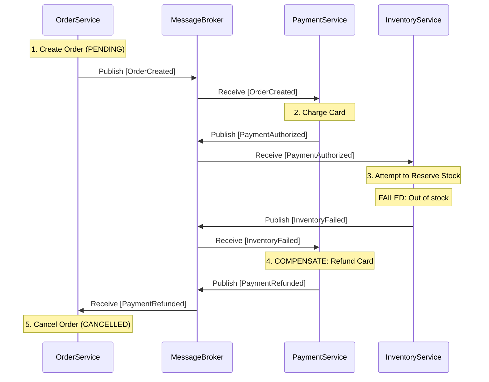

# The Saga Pattern

Because microservices cannot use traditional database transactions (ACID `COMMIT` / `ROLLBACK`) across the network, we must use the **Saga Pattern** to ensure data consistency.

A Saga is a sequence of local database transactions. Each local transaction updates the database and publishes a message/event to trigger the next local transaction in the saga.

If a local transaction fails because it violates a business rule (e.g., the customer's credit card was declined, or the item is out of stock), the saga executes **Compensating Transactions** to undo the changes made by the preceding local transactions.

## Deep Dive: E-Commerce Order Saga

Let's trace a Saga for placing an order that spans three microservices: `Order`, `Payment`, and `Inventory`.

### The Happy Path
1. `Order` creates a new order in its database with the status `PENDING`. It publishes an `OrderCreated` event.
2. `Payment` hears `OrderCreated`. It charges the credit card. It publishes a `PaymentAuthorized` event.
3. `Inventory` hears `PaymentAuthorized`. It deducts the stock. It publishes an `InventoryReserved` event.
4. `Order` hears `InventoryReserved`. It changes the order status in its database to `APPROVED`.

### The Failure Path (Compensating Transactions)
What if the item is out of stock? The previous transactions (creating the order, charging the card) have already been committed to their respective databases. We must roll them back manually.

1. `Order` creates a new order (`PENDING`) and publishes `OrderCreated`.
2. `Payment` charges the card and publishes `PaymentAuthorized`.
3. `Inventory` hears `PaymentAuthorized`, but the item is out of stock! It publishes an **`InventoryFailed`** event.
4. `Payment` hears `InventoryFailed`. It executes a *Compensating Transaction*: It refunds the customer's credit card. It publishes a `PaymentRefunded` event.
5. `Order` hears `PaymentRefunded`. It changes the order status in its database to `CANCELLED`.

### Visualizing the Saga Flow (Choreography)

## Choreography vs. Orchestration

There are two ways to coordinate a Saga:

1. **Choreography (Decentralized)**: Like the example above, there is no central brain. Services publish events and listen to other services' events.
   - *Pros*: Simple for small sagas, highly decoupled.
   - *Cons*: Difficult to track the overall status. If the saga involves 8 services, understanding the flow requires reading code across 8 different repositories.

2. **Orchestration (Centralized)**: A dedicated service (e.g., `OrderSagaOrchestrator`) acts as the "brain". It sends direct *Commands* to other services, waits for their replies, and decides what the next step should be. If a step fails, the Orchestrator commands the other services to rollback.
   - *Pros*: Easy to understand the entire workflow in one place. Better for complex sagas.
   - *Cons*: Creates a single point of failure and tightly couples the Orchestrator to all other services.

## The Cost of Eventual Consistency

During a Saga, the system is in an inconsistent state. For example, between Step 2 and Step 4 of the failure path, the customer has been charged for an item they will not receive. 
Because Sagas execute asynchronously over message brokers, this inconsistency might last for milliseconds, or it might last for hours if the `Inventory` service crashed and is offline. The system will *eventually* become consistent when `Inventory` wakes up and triggers the refund.

## Summary
- Because microservices cannot use 2-Phase Commits (distributed ACID transactions), they use **Sagas**.
- Sagas are a chain of local transactions connected by messages.
- If a step fails, you must execute explicit **Compensating Transactions** to undo the previous steps.
- Sagas can be **Choreographed** (decentralized events) or **Orchestrated** (centralized commands).
